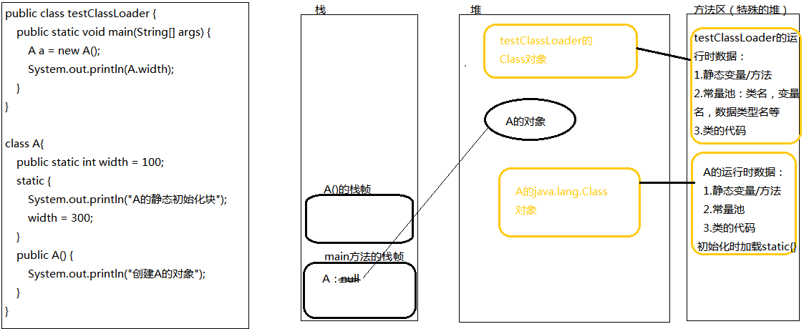

# 3. JVM核心机制与类加载器

JVM运行与类加载过程 

类加载过程：加载--链接--初始化；其中，链接过程：验证--准备--解析 

* 加载：类加载器将class字节码文件加载到内存，将class文件中的静态数据转换为方法区中的运行时数据结构，并在堆中生成Class对象，作为方法区类数据的访问入口。 
* 链接：将运行时数据结构合并到JVM运行状态之中。 
  * 验证：类信息符合JVM规范 
  * 准备：为类变量分配内存，并赋初值0； 
  * 解析：将常量池中的符号引用替换为直接引用。比如：变量名、方法名、数据类型名、类名等。确定符号所对应的数据的地址（绝对地址或相对地址）。 
* 初始化：执行类构造器\(\)的过程。 \(\)由编译器自动收集类中的所有类变量赋值动作，和静态语句块中的语句合并。

## 类的初始化

静态变量=静态域=static field 

类的初始化过程即为执行类构造器&lt;clinit&gt;\(\)的过程。 

类加载的时机：

* 主动引用：（会发生类的初始化） 
* 被动引用：（不会触发类的初始化） 

主动引用过程：

1. new类对象
2. 调用静态成员/方法（final常量不会被引用） 
3. 使用反射加载Class.forName\(""\); 
4. 虚拟机启动时（启动main方法所在的类） 
5. 子类被引用

被动引用过程：

1. 通过数组定义引用（A\[\] as = new A\[10\]） 
2. 访问静态域时，只有声明这个静态域的类会被加载 
3. 引用常量（final）不会触发初始化，在编译阶段保存到类的常量池中

## 类加载器

### 类加载器的层次结构

（组合关系实现） 

引导类加载器（不允许JVM获得引导类加载器的地址）null   
（加载Java核心库E:\Java\jdk1.8.0\_92\jre\lib\rt.jar，用原生代码实现C++）   
            \|   
扩展类加载器sun.misc.Launcher$ExtClassLoader@地址  
 （加载E:\Java\jdk1.8.0\_92\jre\ext下的jar包，Java语言实现，地址可获取）   
                 \|  
应用程序加载器sun.misc.Launcher$AppClassLoader@地址   
（根据类路径classpath或java.class.path加载Java应用类）java.class.path为：E:\Java\jdk1.8.0\_92\lib\javassist.jar; F:\NetBeansProject\testProject\build\classes  //当前程序的类路径  
            \|                                \|  
自定义类加载器     自定义类加载器   
除引导类加载器以外，所有加载器类都继承自java.lang.ClassLoader。 ClassLoader的作用：根据类名 找到/生成 对应的字节码，并从字节码中生成java.lang.Class对象。还负责加载资源、图像等。

### 类加载器的工作模式

 代理模式：交给其他加载器来加载指定类 

**双亲委托机制**：一级一级向上要求双亲类加载，双亲不能加载才由子类进行加载。

 优点：安全，避免用户自定义的类与JDK的核心类冲突/重复。

 核心作用：保证Java核心库的类型安全。 

Tomcat服务器类加载器中的代理模式为：子类加载不了的类才交给父类加载器。

ClassLoader的API：loadClass\(name\)加载名称为name的类，返回Class对象。

### 自定义类加载器

自定义类加载器： 继承java.lang.ClassLoader 

！！！JVM认为只有同一个类被同一个加载器加载才是相同类。

### 自定义类加解密加载器

### 线程上下文类加载器

双亲委托机制的问题：当sun公司提供的接口，实现由第三方公司实现提供时，可能出现接口有引导类加载器或扩展类加载器加载，而它的实现由扩展类加载器或应用程序加载器加载，这会导致（定义接口的）引导类加载器 找不到 扩展类加载器加载的实现类。

线程类加载器默认采用应用程序加载器，可以通过`Thread.currentThread().setContextClassLoader()`自主设置类加载器，避免双亲委派机制的问题。

Tomcat服务器类加载机制：针对每一个项目有一个独立的加载器，且子类加载器加载不到时，才由父类加载器加载。

OSGI（Open Service Gateway Initative）是面向Java的动态模块系统，提供面向服务和基于组件的运行环境，eclipse基于OSGI构建。 OSGI的类加载机制：组件定义的类可以导出供其他类使用，哪个组件定义的类由该组件对应的类加载器加载。 参考资料：Equinox（OSGI的一个实现）

