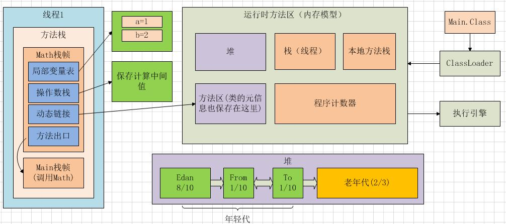
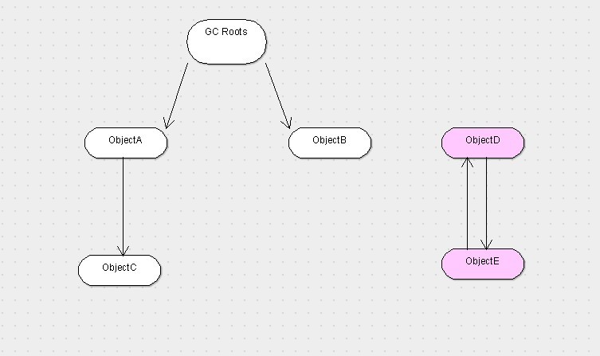

# 内存模型

## JVM内存模型



## 更新

JDK 1.7之后： **JVM 已经将运行时常量池从方法区中移了出来，在 Java 堆（Heap）中开辟了一块区域存放运行时常量池。**\[4\]


## 栈

栈\(线程\) 保存线程信息：线程内局部产量（？），栈帧\(每调用一个方法，都新建一个与之对应的栈帧\) 。

栈帧作用：体现变量的作用域。栈帧内部包含： 

* 局部产量栈：保存栈帧对应方法的局部产量 
* 操作数栈：保存程序运行过程中的中间变量。 jvm的load将整型加载到操作数栈，四则运算也从操作数栈顶取操作数。 
* 动态链接：指向类元信息中的方法，将符号形式的方法调用翻译成实际方法调用。 
* 方法出口：指向调用本方法的位置

## 堆 & 垃圾回收

保存new出来的对象\(new出来的对象中都有一个指针，指向该类的类元信息，动态链接\)。 

### 垃圾回收算法

1. 标记 - 清除
2. 复制
3. 标记 - 整理
4. 分代


----图片来自：[https://snailclimb.top/JavaGuide/\#/./java/jvm/JVM%E5%9E%83%E5%9C%BE%E5%9B%9E%E6%94%B6?id=\_3-%E5%9E%83%E5%9C%BE%E6%94%B6%E9%9B%86%E7%AE%97%E6%B3%95](https://snailclimb.top/JavaGuide/#/./java/jvm/JVM%E5%9E%83%E5%9C%BE%E5%9B%9E%E6%94%B6?id=_3-%E5%9E%83%E5%9C%BE%E6%94%B6%E9%9B%86%E7%AE%97%E6%B3%95)

* 分代回收（新生代、老年代、永久代）
  * 在新生代 - 复制 算法
  * 在老年代 - 标记整理算法
  * 标记清除算法
* 分区回收：分区算法则将整个堆空间划分为连续的不同小区间, 每个小区间独立使用, 独立回收

永久代是Hotspot虚拟机特有的概念，是方法区的一种实现，别的JVM都没有这个东西。在Java 8中，永久代被彻底移除，取而代之的是另一块与堆不相连的本地内存——元空间。\[1\]  
永久代或者“Perm Gen”包含了JVM需要的应用元数据，这些元数据描述了在应用里使用的类和方法。注意，永久代不是Java堆内存的一部分。

哪些对象要被销毁？

* 引用计数算法：存在循环引用的问题
* 跟搜索算法：**设立若干种根对象，当任何一个根对象到某一个对象均不可达时，则认为这个对象是可以被回收的**。\[2\]

### GC Roots

A garbage collection root is an object that is **accessible from outside the heap**. The following reasons make an object a GC root:\[3\]

* System Class
* JNI Local: Local variable in native code, such as user defined JNI code or JVM internal code.
* Thread
* Native Stack
* ...



！！！堆 new出来的对象\(保存在堆中的内容\)什么时候被销毁？

### 分代回收

堆内存大小可以配置，以600兆为例，默认老年代占400兆\(2/3\)，年轻代占200兆\(1/3\)，eden区占160兆\(年轻代的8/10\)。

1）eden区占满之后，gc线程释放eden区中没有指针指向的对象；

2）若再次占满，将有指针指向的对象被移动到from区，

3）若from区在被占满，清理无用对象，有用对象被移动到to区域，to区域成为新的from, 原来的from成为to。

4）上述to和from的一次交替成为一次轮循，15次循环之后依然没有被清理的对象被移动到老年代，

5）老年代满之后，进行full gc。 

年轻代的gc称为manner gc, 老年代的gc成为full gc, full gc的过程非常慢。 若full gc的清理没有释放内存空间\(比如程序设计错误引发内存泄露\)，此时发生oom\(out of memory\).

### 收集器

jdk.hotspot.agent:sun.jvm.hotspot.gc下的几个package：

* serial
* Concurrent mark sweep\(CMS\)
* G1
* parallel
* shared

```java
public abstract class CollectedHeap extends VMObject{}
public class CMSHeap extends GenCollectedHeap{}
public class G1CollectedHeap extends CollectedHeap{}
public class GenCollectedHeap extends CollectedHeap{}
public class ParallelScavengeHeap extends CollectedHeap {}
public class SerialHeap extends GenCollectedHeap {}
```

Garbage collector：

* Serial：新生代复制，
  * 单线程收集器，进行垃圾收集时，需要暂停其他所有工作线程；
  * 优点：简单高效。JVM在client模式下 默认的新生代垃圾收集器
* ParNew：Serial的多线程版本，复制算法，
  * 多线程进行垃圾收集工作，需要暂停其他线程；默认开启与CPU数目相同的线程
  * 简单高效。server端的默认GC
* Parallel scavenge：新生代复制，
  * 与Serial 的区别：重点关注的是程序达到一个可控制的吞吐量。Parallel Scavenge 收集器提供了很多参数供用户找到最合适的停顿时间或最大吞吐量。
  * 吞吐量：代码运行时间 / \(代码运行时间 + GC时间\)
* Serial old：serial的老年代版本，单线程 标记-整理算法
  * client端 默认的老年代GC
  * server 端
* Parallel old：parallel scavenge 的老年代版本，多线程标记 - 整理算法
* Concurrent mark sweep：老年代GC，多线程 标记-清除，
  * 主要目标：获得最短垃圾回收停顿时间
* G1 \(Garbage-First\)：是一款面向服务器的垃圾收集器
  * 主要针对配备多颗处理器及大容量内存的机器. 以极高概率满足GC停顿时间要求的同时,还具备高吞吐量性能特征

## 方法区/元空间

保存静态变量，常量，类元信息\(类的模板\)

方法区（相当于接口）与永久代（相当于实现类）：永久代是方法区的一种实现方式。

**注意！**堆和方法区线程共享。 线程栈，本地方法栈和程序计数器 线程独享。

## 本地方法栈

调用本地方法时保存局部产量的栈 用native修饰的方法是本地方法，本地方法会调用c语言的库函数\(类似于系统调用\)，现在用的比较少了。 

程序计数器

字节码文件被类加载器拆解，对应的数据放到内存模型的对应位置。

## JVM调优

环境

* 调整堆内存大小、各个分区比例等
* 垃圾回收器的选择

Javap -c 对class文件进行反汇编，生成汇编文件，对照jvm指令手册可以查看汇编命令的含义。

## reference

\[1\] [https://www.cnblogs.com/snowwhite/p/9532311.html](https://www.cnblogs.com/snowwhite/p/9532311.html)

\[2\] [https://www.cnblogs.com/zuoxiaolong/p/jvm3.html](https://www.cnblogs.com/zuoxiaolong/p/jvm3.html)

\[3\] [http://help.eclipse.org/luna/topic/org.eclipse.mat.ui.help/concepts/gcroots.html?resultof=%22%47%61%72%62%61%67%65%22%20%22%67%61%72%62%61%67%22%20%22%43%6f%6c%6c%65%63%74%69%6f%6e%22%20%22%63%6f%6c%6c%65%63%74%22%20%22%52%6f%6f%74%73%22%20%22%72%6f%6f%74%22%20](http://help.eclipse.org/luna/topic/org.eclipse.mat.ui.help/concepts/gcroots.html?resultof=%22%47%61%72%62%61%67%65%22%20%22%67%61%72%62%61%67%22%20%22%43%6f%6c%6c%65%63%74%69%6f%6e%22%20%22%63%6f%6c%6c%65%63%74%22%20%22%52%6f%6f%74%73%22%20%22%72%6f%6f%74%22%20)

\[4\] [https://snailclimb.top/JavaGuide/\#/?id=java](https://snailclimb.top/JavaGuide/#/?id=java)

