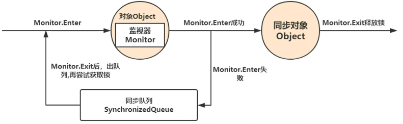
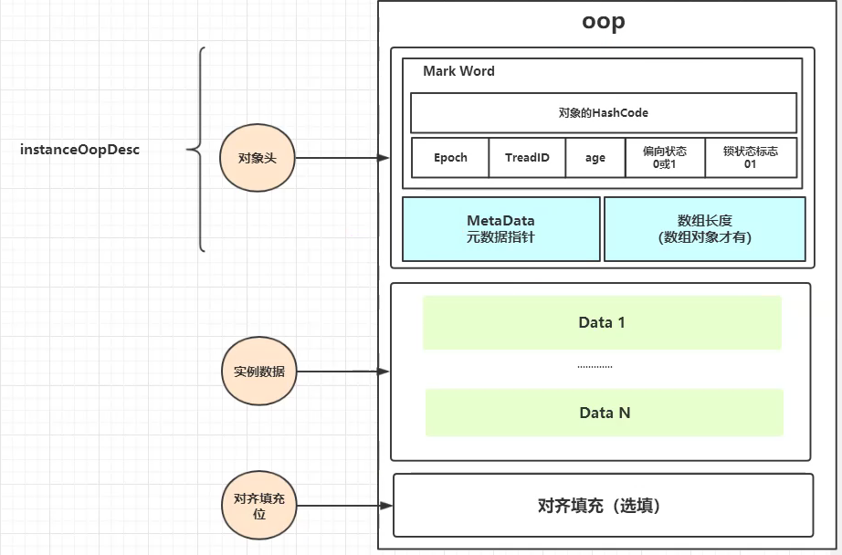
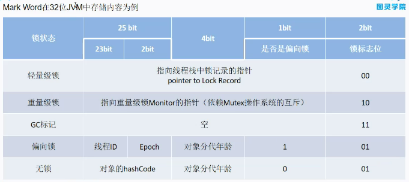

# synchronized锁机制

## Synchronized同步器的使用方法与原理

1. 锁的表现形式与使用形式

* 显式锁——需要手动加锁、解锁，控制更加灵活，可以灵活的控制锁的力度。Eg：ReentrantLock
* 隐式锁（JVM内置锁）——不需要手动加解锁，JVM自动执行（JVM在JDK1.6之前，内置锁都是排他锁，非常笨重）

同步块在JVM中的执行：悲观 or 乐观？——悲观

Synchronized使用方式：

* 同步方法`public Synchronized void syncDemo1()`
* 同步类，同步当前类对象
* 同步代码块

```java
//同步代码块
Object lock = new Object();
public void syncDemo1(){
         synchronized(lock){ //同步代码块，锁加在lock对象上，
                   //业务逻辑
         }
}

//同步方法
public Synchronized void syncDemo1(){
         //业务逻辑
         //相当于Synchronized(this){}
}

//锁加在当前对象this上，
public void methodName(){
    synchronized(this){
        //此类的其他对象不可以同时访问这段代码
    }
}

//锁加在类上，
public class ClassName{
    public void methodName(){
        synchronized(ClassName.class){
        //此类的其他对象不可以同时访问这段代码
        }
    }
}
```

反编译查看`synchronized`部分的节码

`Monitorenter //标记程序即将进入同步块Monitor enter  
…  
Monitorexit //标记程序退出同步块，Monitor exit`

Synchronized 是JVM内置锁，通过Monitor（监视器锁，管程）实现，依赖操作系统的Mutex lock（互斥锁）实现。

Synchronized基于对象加锁，每个对象都对应了一个Monitor，JVM的锁机制都是通过Monitor实现。



JVM如何判断当前对象已加锁：在对象中添加标记，用来记录锁状态。

JVM中的对象结构：

* 对象头
* 示例数据
* 对齐填充位（用来对齐，没有实际意义）

类信息在JVM中也是以对象的形式保存的，普通对象的元数据指针就指向这样的对象。

对象头中保存对象状态信息，其中的Mark Word记录对象的锁状态，如：ThreadID记录获得锁的线程ID，偏向状态记录是否为偏向锁，锁状态标志记录是否加锁。Age记录对象所属的年代，



实例对象在JVM中的存储方式：

* 实例对象保存在堆中；
* 元数据指针指向方法区（1.8之后成为元空间），即对象的元数据保存在方法区；
* 对象的引用保存在线程栈。

锁的类型：偏向锁—轻量级锁—重量级锁

重量级锁：立即向系统申请互斥量，被称为重量级锁的原因：需要将CPU的线程上下文由用户态切换到内核态

JDK1.5及之前，JVM都是重量级锁  
JDK1.6之后，对JVM内置锁 进行优化，设计了锁的膨胀和升级的过程，无锁 -&gt; 偏向锁 -&gt; 轻量级锁 –&gt; 重量级锁，默认开启偏向锁；还增加了适应性自旋（CAS自旋），

开启偏向锁会提高执行效率。JVM支持设置是否开启偏向锁

* 偏向锁：只有一个线程进入临界区，适用于只有一个线程访问代码块的情况。
* 轻量级锁：多线程为竞争或者竞争不激烈，适用于追求响应时间的情况，同步块执行速度非常快。
* 重量级锁：多线程竞争，适用于追求吞吐量的情况。

### JVM锁的膨胀过程

（Mark Word记录锁状态，膨胀过程体现在对象上就是Mark Word的变化）：

1. 初始状态：无锁状态，锁标志位是01（即无锁）。
2. 当有线程访问该对象时，用cas修改Mark Word的锁状态：从无锁状态转换到偏向锁状态。
3. 若又有一个线程，如线程2，来执行同步块，检查线程锁状态，检查Mark Word中的线程ID是否为自己，若不是，尝试用CAS将Mark Word中的线程ID改变成自己的，若修改失败，Mark Word切换到轻量级锁的状态，
4. 若CAS执行次数达到某个值，锁状态由轻量级转到重量级。 



锁标志位为11时，这个对象可以被GC。

## 无锁同步算法：cas\(compare and swap\)

CAS是操作系统提供的指令——原子操作。cas的操作数：

* 内存位置V
* 预期原值 A
* 新值 B

若地址V的值是A，将A修改为B；若不是A，而是另外的值（记为A1）得话，不进行任何操作；操作返回值为地址V的值（成功修改的话，返回B，未修改的话，返回A1）。

CAS的好处：当有多个线程要对变量进行修改（例如将A修改为B）时，只有一个线程可以修改成功，该线程修改成功之后，其他线程读到的地址V处的值就是B，这与其他线程之前保存的预期原值A不同，无法成功修改变量值。  
修改失败的线程不让出CPU，可以重新尝试修改操作。

CAS的问题：aba问题（丢失修改过程）

解决方案：版本号

## 


