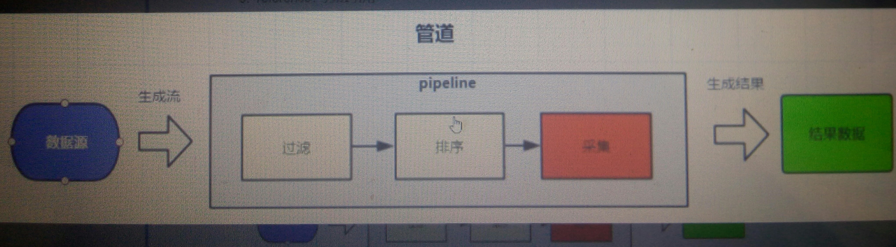

# Stream in jdk8

## Java8的stream机制

——根本目的是缓解数据库压力！

Stream用于对集合迭代器的增强，使之能更高效的完成聚合\(过滤 排序 统计分组\)操作或者大批量数据操作。Stream的编码效率高，可读性强，编译成类文件依然是循环语句实现。

`public List<Apple> getAppleByParam(Predicate<? super Apple> p){                   return appleStore.stream().filter(p).collect(Collectors.toList());   }` 

示例：collection.stream\(\).filter\(限定条件\)，filter\(\) collector\(\) groupingBy\(\)

Stream与sql可以实现相似的效果，为什么不用sql? 

* 为数据库减压。扩充应用服务器的成本远远低于扩充服务器的成本。阿里开发规范提到，数据库尽量只做查询，不要用来实现业务逻辑。 
* 数据源十分多样化，nosql, redis等数据源，不一定支持sql。 
* 跨数据库的join无法实现，可以用stream。
* 解决N+1问题，根据订单信息获得会员id，根据会员id查询信息，需要进行n次查询。

## Java8最大的更新

——支持lambda表达式\(闭包，函数式编程\)。  
Lambda表达式的形式： 

* 表达式expression，参数在括号中给出 `new Thread(() -> System.out.println("hello"));`  
* 语录块`new Thread(() -> { System.out.println("hello");       System.out.println("world");} );` 
* 方法引用 `sayHello(Sysrem.out::println("hello"));` 
  * ::表示引用，sayHello是函数式接口中的抽象方法 

Lambda表达式只能用在函数式接口上，**函数式接口：只有一个抽象方法的接口；**接口中有多个方法时，只能有一个是抽象的，其余方法用default关键字给出默认实现。Object类中的方法忽略**仅一个抽象方法**的规则。

## Stream实现机制——管道

Stream特点：不保存数据，不改变数据源，不可重复使用\(一个流只能使用一次\)。 `Stream s=appStore.stream();s.filter();//s之后不能再使用` 

* 中间操作：返回新生成的流，如map, filter, distinct\(去重\), peek\(遍历\) 
* 终值操作：返回最终结果，如forEach\(遍历\), max, collect等 

中间操作都是懒操作，只是为了进行累加计算\(可以有多个\)，仅在遇到终值操作\(一个流只进行一个终值操作\)时，才会执行之前所有的中间操作。

具体执行过程：取一个数据，执行所有的中间操作，产生结果。也就是若干个中间操作在一个for循环中进行。 sort操作比较特殊，其内部使用冒泡排序，需要把所有的数据取出来，中间操作包含sort的，具体执行时，需要多个for循环。

map操作将流中元素一对一的映射成另外一个元素。mapToInt 将集合元素映射成整型数据。 `Stream.collect(Collectors.groupingBy(a->a.getColor(), Collectors.summingToInt()))`

